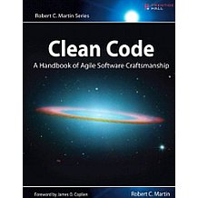

# Clean Code

Contents

1. [Clean Code](#1-clean-code)
1. [Meaningful Names](#2-meaningful-names)
1. [Functions](#3-functions)

## 1. Clean Code

...

## 2. Meaningful Names

...

## 3. Functions

Functions should be small.

The blocks within `if` statements, `else` statements, `while` statements should be one line long. Probably that line should be a function call.

The indent level of a function should not be greater than one or two.

Functions should do one thing.

Functions divided into sections such as declarations, initializations and sieve have an obvious symptom of doing more than one thing.

TODO: The Stepdown Rule
TODO: Switch statements

One level of abstraction per function.

A long descriptive name is better than a short enigmatic name

The ideal number of arguments for a function is zero, three arguments should be avoided where possible.

Arguments are even harder from a testing point of view. You need to test all the various combinations of arguments work properly, that is difficult.

Passing a boolean into a function is a terrible practice.

When a function seems to need more than two or three arguments, it is likely that some of those arguments ought to be wrapped into a class of their own.

Functions should either do something or answer something, but not both. Either a function should change the state of an object, or it should return some information about that object.

Return exceptions, no error codes.

It is better to extract the bodies of the `try` and `catch` block out into functions of their own.

A function that handles errors should do nothing else. If the keyword `try` exist in a function, it should be the first word in the function and that there should be nothing after the `catch` `finally` blocks.

Don't repeat code.
